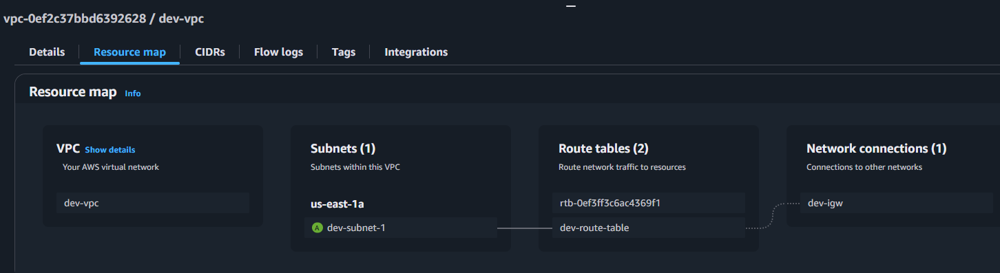

### Terraform Practice

#### t001 Create EC2 instance

- Create vpc, subnet, security group (ingress & egress) & EC2 instance. Separete file for variables.

#### t002 Create EC2 instance using modules

- write provider and resource in ec2.tf file and give module reference in main.tf file for ec2.tf

#### t002 Create EC2 instance and install docker in it.

- main.tf
    - Variables
    - Resources block (aws_vpc,aws_subnet, aws_route_table, aws_internet_gateway, aws_route_table_association, aws_security_group, aws_instance)
    - Output block
- terraform.tfvars
    - contains variables and their values.

